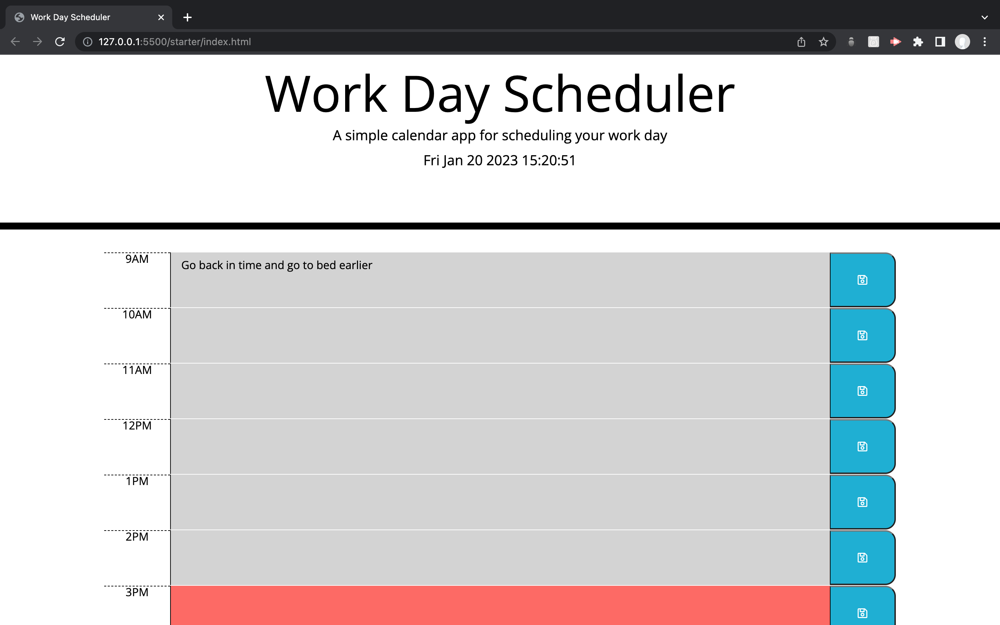
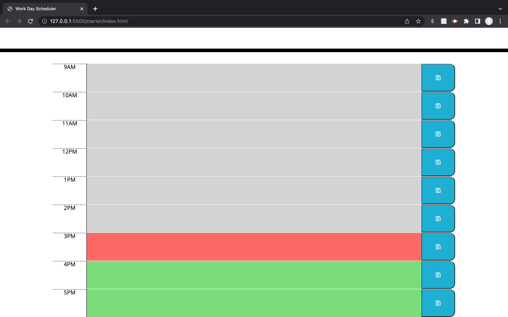

# Work Day Scheduler

## Description

A one day application that color codes the hour slots according to whether they are in the past, future or at the current hour. A user is able to enter text in the colored areas and the app persists the data between refreshes.

## URL: https://github.com/dantrovato/work-day-scheduler/deployments

### What it looks like

